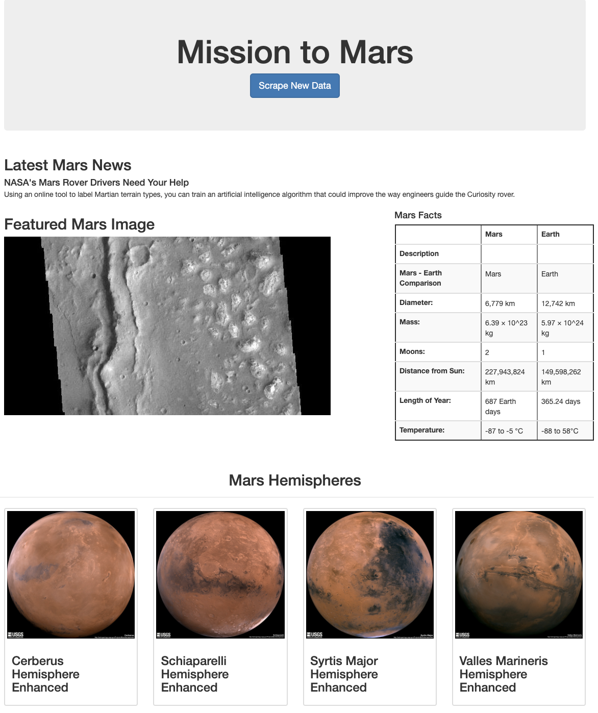

## Mission to Mars


## Step 1 - Scraping

We completed initial scraping using Jupyter Notebook, BeautifulSoup, Pandas, and Requests/Splinter.

We create a Jupyter Notebook file called `mission_to_mars.ipynb` and use this to complete all of your scraping and analysis tasks. The following outlines what you need to scrape.

### NASA Mars News

* We Scraped the [Mars News Site](https://redplanetscience.com/) and collect the latest News Title and Paragraph Text. Assign the text to variables that you can reference later.

```python

# Example:
news_title = "NASA's Next Mars Mission to Investigate Interior of Red Planet"

news_p = "Preparation of NASA's next spacecraft to Mars, InSight, has ramped up this summer, on course for launch next May from Vandenberg Air Force Base in central California -- the first interplanetary launch in history from America's West Coast."
```

### JPL Mars Space Images - Featured Image

* We Visited the url for the Featured Space Image site [here](https://spaceimages-mars.com).

* Used splinter to navigate the site and find the image url for the current Featured Mars Image and assign the url string to a variable called `featured_image_url`.

```python
# Example:
featured_image_url = 'https://spaceimages-mars.com/image/featured/mars2.jpg'
```

### Mars Facts

* We visited the Mars Facts webpage [here](https://galaxyfacts-mars.com) and use Pandas to scrape the table containing facts about the planet including Diameter, Mass, etc.

* We used Pandas to convert the data to a HTML table string.

### Mars Hemispheres

* We visitd the astrogeology site [here](https://marshemispheres.com/) to obtain high resolution images for each of Mar's hemispheres.

* We need to click each of the links to the hemispheres in order to find the image url to the full resolution image.

* We saved both the image url string for the full resolution hemisphere image, and the Hemisphere title containing the hemisphere name. Used a Python dictionary to store the data using the keys `img_url` and `title`.

* Append the dictionary with the image url string and the hemisphere title to a list. This list will contain one dictionary for each hemisphere.

```python
# Example:
hemisphere_image_urls = [
    {"title": "Valles Marineris Hemisphere", "img_url": "..."},
    {"title": "Cerberus Hemisphere", "img_url": "..."},
    {"title": "Schiaparelli Hemisphere", "img_url": "..."},
    {"title": "Syrtis Major Hemisphere", "img_url": "..."},
]
```

- - -

## Step 2 - MongoDB and Flask Application

We Used MongoDB with Flask templating to create a new HTML page that displays all of the information that was scraped from the URLs above.

* Started by converting our Jupyter notebook into a Python script called `scrape_mars.py` with a function called `scrape` that execute all of our scraping code from above and return one Python dictionary containing all of the scraped data.

* Next, we created a route called `/scrape` that import our `scrape_mars.py` script and call our `scrape` function.

  * We stored the return value in Mongo as a Python dictionary.

* We created a root route `/` that query our Mongo database and pass the mars data into an HTML template to display the data.

* We create a template HTML file called `index.html` that takes the mars data dictionary and display all of the data in the appropriate HTML elements. Use the following as a guide for what the final product should look like, but feel free to create your own design.



- - -

## Hints

* We used Splinter to navigate the sites when needed and BeautifulSoup to help find and parse out the necessary data.

* We used Pymongo for CRUD applications for your database. For this homework, you can simply overwrite the existing document each time the `/scrape` url is visited and new data is obtained.

* We used Bootstrap to structure your HTML template.


© 2021 Trilogy Education Services, LLC, a 2U, Inc. brand. Confidential and Proprietary. All Rights Reserved.
